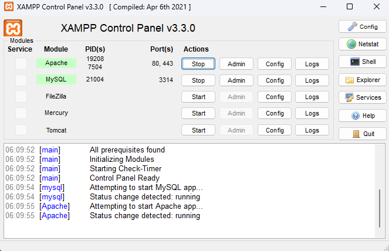

# Sistem Toko Furnitur (WoodWonders)

## How to Run

1. Clone Github Ini

```
git clone https://github.com/rasyadanfz/furniture-system.git
```

2. Pindah ke direktori folder

```
cd furniture-system
```

3. Pastikan [Composer](https://getcomposer.org/download/) dan [XAMPP](https://www.apachefriends.org/download.html) sudah terinstall pada machine anda

4. Jalankan Apache dan MySQL pada XAMPP Anda



5. Buka phpMyAdmin pada http://localhost/phpmyadmin, dan buat database baru bernama furniture_db


6. Rename .env.example menjadi env
7. Pada file .env ubah database.default.port menjadi Port MySQL yang digunakan pada XAMPP

```
database.default.port = Your_XAMPP_MySQL_Port
```

8. Kemudian jalankan perintah

```
composer update
```

9. Sebelum melanjutkan, pastikan sistem [Toko Material](https://github.com/Gabrielpjt/TST-toko-material-toko-furnitur) sudah dijalankan

10. Jika sudah, jalankan perintah berikut

```
php spark migrate
php spark db:seed DBSeeder
php spark serve --port 6161
```

11. Sistem dapat diakses pada http://localhost:6161
